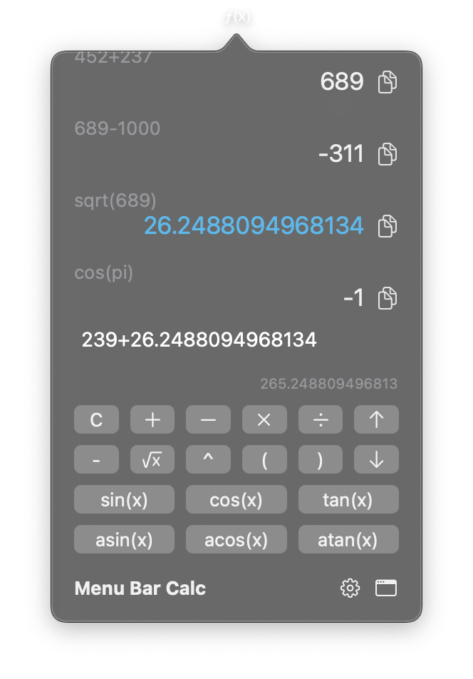
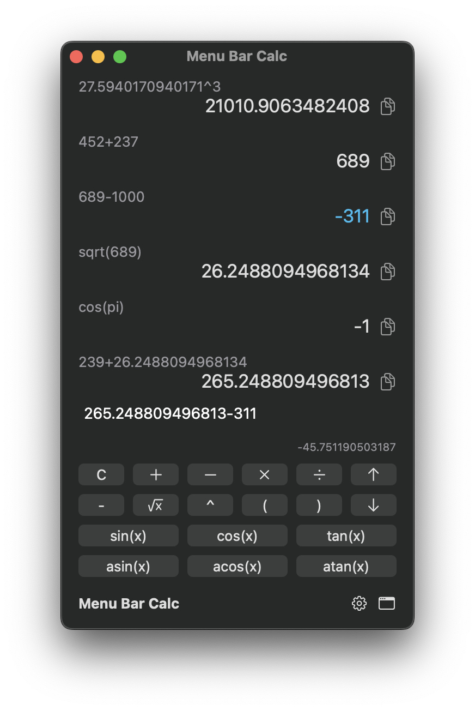

# Menu Bar Calculator for macOS

A calculator that lives in your menu bar and keeps a history of your calculations




## Opening
- The app is currently not signed, so simply double clicking the app will not open it
- You must right click the app and choose 'Open'
- You will then receieve a warning popup that the app cannot be checked for malicious software
- You can then choose the button to 'Open' it

## Usage
- Calculator can be accessed by pressing the `f(x)` symbol in your menu bar
- The calculator can also be toggled with the global shortcut `option + command + c`
- Calculations can be typed and submitted to history by pressing `Enter`
- History is saved even when the app is quit. It can also be cleared.
- Pprevious solutions or expressions can be added to the textfield by clicking on them
- Previous solutions can also be added by cycling through them with arrow keys or the arrow buttons
- Previous solutions can be copied to the clipboard by pressing the copy symbol to the right each submitted solution
- Typing infix operators (excluding `e` and `-`) will insert the previous answer before them for continuous calculations
- A live preview of the calculation is shown while typing an expression

### Notes
- Non-valid calculations cannot be submitted to history
- Parentheses must be closed for valid calculations
- Syntax must be valid (only numbers with supported operators, functions and constants)

### Currently supported math symbols:

**constants**

```swift
pi
```

**infix operators**

```swift
+ - / * % ^ e
```

**prefix operators**

```swift
-
```

**functions**

```swift
// Unary functions

sqrt(x)
floor(x)
ceil(x)
round(x)
cos(x)
acos(x)
sin(x)
asin(x)
tan(x)
atan(x)
abs(x)

// Binary functions

pow(x,y)
atan2(x,y)
mod(x,y)

// Variadic functions

max(x,y,[...])
min(x,y,[...])
```

### Credits
- The [Expression](https://github.com/nicklockwood/Expression#math-symbols) framework by Nick Lockwood
- The [HotKey](https://github.com/soffes/HotKey) package by soffes

